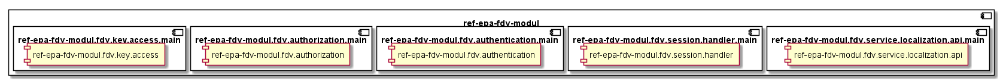
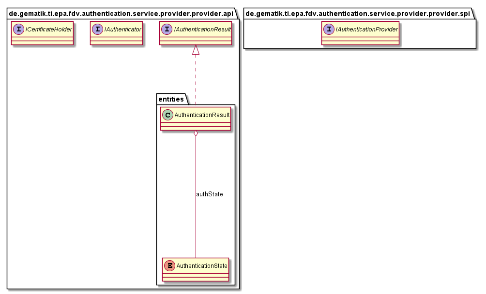
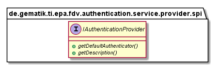
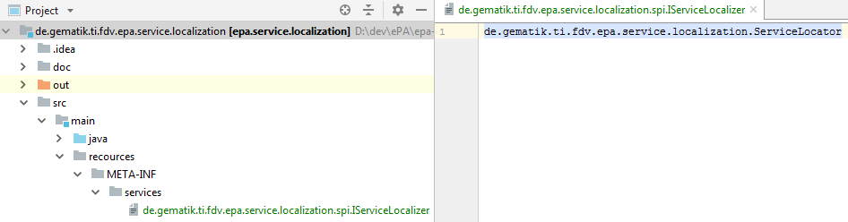

# FdV Module Java Libraries

## Introduction

This part describes the ePA FdV Modul functionalities and structure.

## API Documentation

Generated API docs are available at <https://gematik.github.io/ref-FdVModul>.

## License

Licensed under the [Apache License, Version 2.0](https://www.apache.org/licenses/LICENSE-2.0).

## Overview

The FdV module bundles libraries that provide the functions (service localization, authentication, authorization, session handling, key access) necessary for the use of the electronic patient record.

  

### FdV Authentication

The authentication module provides the functionalities for authenticating the user to use the electronic patient record.
All available IAuthenticator and the selected one will be returned by the AuthnService.
The Authn class enforces required operations (login create challenge / login create token / renew token / logout token) according to ws-Trust to authenticate the user.
The AuthenticationBindingSoap class forms the entry point for establishing the connection to the authentication web service.

  

### FdV Authorization

The authorization module is not yet implemented

  

### FdV Key Access

The key access module is not yet implemented

  

### FdV Session Handler

The FdV SessionHandler module provides a ServiceLocalizerLoader for available service localization services.

  

### Service Localization API

  

#### IService Localizer

Interface to be implemented by service localizer as entry point to localize ePA service components.
Start lookup DNS for retrieving endpoint URLs of various ePA gateway services.
Once lookup has been done successfully, endpoint URLs for interfaces in ServiceInterfaceName can be retrieved.

  

The specific service localization needs a descriptor behind `YOUR.service.localization\src\main\resources\META-INF\services` with filename
`de.gematik.ti.fdv.epa.service.localization.spi.IServiceLocalizer` and the content of the package and class which implements the service localizer interface e.g. `de.gematik.ti.fdv.epa.service.localization.ServiceLocator`

#### ServiceInterfaceName

Description of the service interfaces and assignments of paths to the ePA file system components

#### LookupStatus

Status of service lookup in DNS - As long as the Service lookup is running, thus it might still in progress after ServiceLocatorType object has been initialized, or lookup was not successful for some reason, e.g. DNS was not accessible

  

### Authentication Service Provider

  

#### Authentication Service Provider Interface

The entry point for the ServiceLoader is the Authentication Service Provider Interface.
This Interface returns the specific authentication provider implementation and a provider description.

  

The specific authentication.provider needs a descriptor behind `YOUR.PROVIDER\src\main\resources\META-INF\services` with filename
`de.gematik.ti.fdv.authentication.service.provider.api.IAuthenticator` and the content of the package and class which implements the service provider interface e.g. `de.gematik.ti.epa.fdv.healthcard.authentication.Authenticator`

## Getting Started

### Build setup FdV Module

To use ePA FdV Modul library in a project, you need just to include following dependency:

**Gradle dependency settings to use ePA FdV Modul library.**

    dependencies {
        implementation group: 'de.gematik.ti.epa', name: 'fdv.authentication', version: '1.0.3'
    }

**Maven dependency settings to use ePA FdV Modul library.**

    <dependencies>
        <dependency>
            <groupId>de.gematik.ti.epa</groupId>
            <artifactId>fdv.authentication</artifactId>
            <version>1.0.6</version>
        </dependency>
    </dependencies>

### Build setup Authentication

To use ePA Authentication library in a project, you need just to include following dependency:

**Gradle dependency settings to use ePA Authentication library.**

    dependencies {
        implementation group: 'de.gematik.ti.epa', name: 'fdv.authentication', version: '{version_FDVMODUL}'
    }

**Maven dependency settings to use ePA Authentication library.**

    <dependencies>
        <dependency>
            <groupId>de.gematik.ti.epa</groupId>
            <artifactId>fdv.authentication</artifactId>
            <version>{version_FDVMODUL}</version>
        </dependency>
    </dependencies>

### Build setup Authorization

To use ePA Authorization library in a project, you need just to include following dependency:

**Gradle dependency settings to use ePA Authorization library.**

    dependencies {
        implementation group: 'de.gematik.ti.epa', name: 'fdv.authorization', version: '{version_FDVMODUL}'
    }

**Maven dependency settings to use ePA Authorization library.**

    <dependencies>
        <dependency>
            <groupId>de.gematik.ti.epa</groupId>
            <artifactId>fdv.authorization</artifactId>
            <version>{version_FDVMODUL}</version>
        </dependency>
    </dependencies>

### Build setup Key Access

To use Key Access library in a project, you need just to include following dependency:

**Gradle dependency settings to use Key Access library.**

    dependencies {
        implementation group: 'de.gematik.ti.epa', name: 'fdv.key.access', version: '{version_FDVMODUL}'
    }

**Maven dependency settings to use Key Access library.**

    <dependencies>
        <dependency>
            <groupId>de.gematik.ti.epa</groupId>
            <artifactId>fdv.key.access</artifactId>
            <version>{version_FDVMODUL}</version>
        </dependency>
    </dependencies>

### Build setup Session Handler

To use ePA Session Handler library in a project, you need just to include following dependency:

**Gradle dependency settings to use ePA Session Handler library.**

    dependencies {
        implementation group: 'de.gematik.ti.epa', name: 'fdv.session.handler', version: '{version_FDVMODUL}'
    }

**Maven dependency settings to use ePA Session Handler library.**

    <dependencies>
        <dependency>
            <groupId>de.gematik.ti.epa</groupId>
            <artifactId>fdv.session.handler</artifactId>
            <version>{version_FDVMODUL}</version>
        </dependency>
    </dependencies>

### Build setup Service Localization API

To use ePA Service Localization API library in a project, you need just to include following dependency:

**Gradle dependency settings to use ePA Service Localization API library.**

    dependencies {
        implementation group: 'de.gematik.ti.epa', name: 'fdv.service.localization.api', version: '{version_FDVMODUL}'
    }

**Maven dependency settings to use ePA Service Localization API library.**

    <dependencies>
        <dependency>
            <groupId>de.gematik.ti.epa</groupId>
            <artifactId>fdv.service.localization.api</artifactId>
            <version>{version_FDVMODUL}</version>
        </dependency>
    </dependencies>

### Build setup Authentication Service Provider

To use Authentication Service Provider library in a project, you need just to include following dependency:

**Gradle dependency settings to use Authentication Service Provider library.**

    dependencies {
        implementation group: 'de.gematik.ti.epa', name: fdv.'authentication.service.provider', version: '{version_FDVMODUL}'
    }

**Maven dependency settings to use Authentication Service Provider library.**

    <dependencies>
        <dependency>
            <groupId>de.gematik.ti.epa</groupId>
            <artifactId>fdv.authentication.service.provider</artifactId>
            <version>{version_FDVMODUL}</version>
        </dependency>
    </dependencies>
